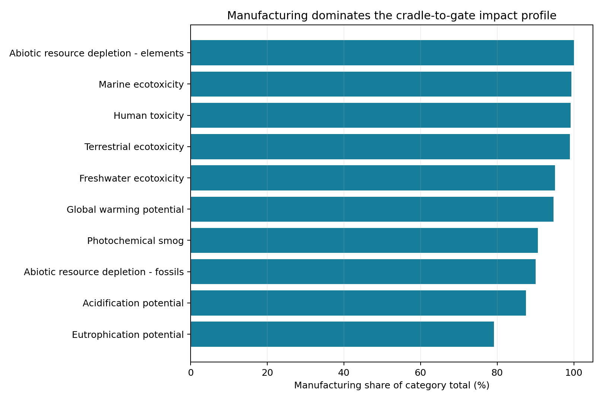
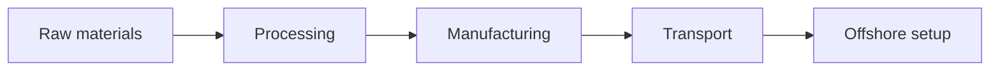
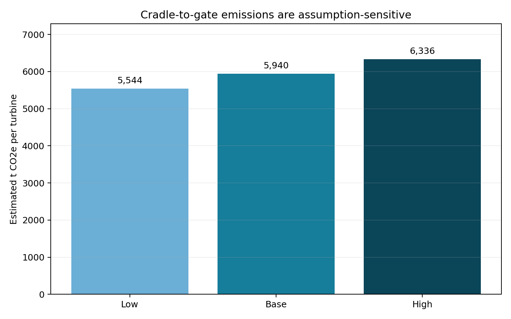

# Where Is the Carbon Before an Offshore Turbine Operates?

## A cradle-to-gate boundary and scenario study for the Vestas V236-15 MW

[](https://github.com/Vedant-Au/offshore-wind-carbon-footprint-model/actions/workflows/quality.yml)

> **94.7%** — Manufacturing contributes 7.1 of the 7.5 g CO2e/kWh
> cradle-to-gate profile preserved in the case evidence.

That result makes the first management question clear: focus supplier and engineering effort on materials and manufacturing before optimising the smaller setup contribution.



## Boundary before number



This is a **cradle-to-gate** view. Operations, maintenance and end-of-life sit outside the scenario. That distinction matters because carbon figures with different system boundaries cannot be ranked as though they measure the same thing.

| Included in the model | Not claimed by the model |
| --- | --- |
| Published stage-intensity reference table | Verified product carbon footprint |
| Manufacturing/setup contribution by impact category | Supplier-specific bill of materials |
| 70%, 75% and 80% allocation scenarios | Whole-life competitor comparison |
| Unit and reconciliation checks | Abatement cost or engineering feasibility |

## Two calculations—kept deliberately separate

### Impact-category view

`manufacturing share = manufacturing / (manufacturing + plant setup)`

### Turbine planning view

`cradle-to-gate t CO2e = 528 t CO2e/MW × 15 MW × allocation share`

The second view produces **5,544-6,336 t CO2e per turbine** across the 70%-80% range. It is a planning scenario, not an extra quantity to add to the per-kWh profile.



## Decision implications

1. Engage steel, composite and component suppliers on verified embodied-carbon data.
2. Test lower-carbon material and manufacturing alternatives against cost and technical constraints.
3. Address logistics after the dominant manufacturing hotspots are understood.
4. Refresh the model when supplier and bill-of-material evidence replaces reference assumptions.

I led the underlying MSc assessment: defining the boundary, applying ISO 14040/14044 logic, converting intensity factors into turbine scenarios and rejecting invalid competitor comparisons.

## Calculation audit

The full formula trail is in [boundary and calculations](docs/BOUNDARY_CALCULATIONS.md); reconciliations and interpretation checks are in [model checks](docs/MODEL_CHECKS.md).

```bash
pip install -r requirements.txt
python analysis.py
python -m unittest discover -s tests -v
```

> **Use with care:** reference inputs come from an academic case, not a verified inventory. The work is not affiliated with or endorsed by Vestas or Siemens Gamesa. See [ASSET_NOTICE.md](ASSET_NOTICE.md).
